# Health Oracle - Диаграмма классов

```mermaid
---
config:
  class:
    hideEmptyMembersBox: false
  layout: elk
  look: classic
  theme: redux
---
classDiagram
direction TB
    class MyApp {
	    +ThemeData theme
	    +String title
	    +Widget build(BuildContext)
    }

    class MainNavigator {
	    -int _currentIndex
	    -List~Widget~ _pages
	    -PageController _pageController
	    +State createState()
	    -void _onItemTapped(int)
	    -Widget _buildBottomNavBar()
	    -void _navigateToPage(int)
    }

    class HomePage {
	    -List~MetricCard~ _metricCards
	    -MLPrediction _predictions
	    +State createState()
	    +void loadMetrics()
	    +void refreshData()
	    +Widget build(BuildContext)
    }

    class HistoryPage {
	    -DateTime _selectedDate
	    -List~MetricType~ _filters
	    -List~HealthRecord~ _records
	    +State createState()
	    +void loadHistory()
	    +void filterByDate(DateTime)
	    +void filterByType(MetricType)
	    +void exportData()
	    +Widget build(BuildContext)
    }

    class GroupPage {
	    -String _groupId
	    -List~User~ _members
	    -Map~User,List~HealthRecord~~ _groupData
	    +State createState()
	    +void loadGroupData()
	    +void compareMetrics()
	    +void inviteMember()
	    +void leaveGroup()
	    +Widget build(BuildContext)
    }

    class ProfilePage {
	    -User _currentUser
	    -UserStats _stats
	    +State createState()
	    +void loadProfile()
	    +void updateProfile()
	    +void navigateToSettings()
	    +void navigateToNotifications()
	    +Widget build(BuildContext)
    }

    class SettingsPage {
	    -AppSettings _settings
	    +State createState()
	    +void saveSettings()
	    +void changeTheme(ThemeMode)
	    +void changeLanguage(String)
	    +void changeUnits(UnitSystem)
	    +void toggleNotifications(bool)
	    +void navigateToExport()
	    +Widget build(BuildContext)
    }

    class NotificationsPage {
	    -List~Notification~ _notifications
	    -NotificationSettings _settings
	    +State createState()
	    +void loadNotifications()
	    +void markAsRead(String)
	    +void deleteNotification(String)
	    +void configureReminders()
	    +Widget build(BuildContext)
    }

    class ExportPage {
	    -DateRange _exportRange
	    -List~MetricType~ _selectedMetrics
	    -ExportFormat _format
	    +State createState()
	    +void selectDateRange()
	    +void selectMetrics()
	    +void exportToCSV()
	    +void exportToJSON()
	    +void exportToPDF()
	    +void sendByEmail(String)
	    +Widget build(BuildContext)
    }

    class AddEntryModal {
	    +VoidCallback onSave
	    +VoidCallback onCancel
	    -Set~MetricType~ _selectedTypes
	    -Map~MetricType,dynamic~ _values
	    +State createState()
	    +void toggleMetricType(MetricType)
	    +void saveEntry()
	    +void validateData()
	    +Widget build(BuildContext)
    }

    class QuickAddWidget {
	    +MetricType metricType
	    +VoidCallback onAdded
	    -TextEditingController _controller
	    +void quickSave()
	    +void voiceInput()
	    +Widget build(BuildContext)
    }

    class ManualEntryForm {
	    +MetricType metricType
	    +HealthRecord initialData
	    -Map~String,TextEditingController~ _controllers
	    -DateTime _dateTime
	    -String _notes
	    +void setDateTime(DateTime)
	    +void addNote(String)
	    +void saveRecord()
	    +Widget build(BuildContext)
    }

    class MetricInterface {
	    +String id
	    +String title
	    +String unit
	    +Gradient gradient
	    +IconData icon
	    +dynamic getCurrentValue()
	    +String getDescription()
	    +DateTime getLastUpdate()
	    +bool validate(dynamic)
	    +String format(dynamic)
    }

    class PressureMetric {
	    +String id
	    +String title
	    +String unit
	    +int systolic
	    +int diastolic
	    +Gradient gradient
	    +IconData icon
	    +dynamic getCurrentValue()
	    +String getDescription()
	    +bool validate(dynamic)
	    +String getCategory()
    }

    class PulseMetric {
	    +String id
	    +String title
	    +String unit
	    +int bpm
	    +Gradient gradient
	    +IconData icon
	    +dynamic getCurrentValue()
	    +String getDescription()
	    +bool validate(dynamic)
	    +bool isNormal()
    }

    class SugarMetric {
	    +String id
	    +String title
	    +String unit
	    +double glucose
	    +MeasurementType type
	    +Gradient gradient
	    +IconData icon
	    +dynamic getCurrentValue()
	    +String getDescription()
	    +bool validate(dynamic)
	    +bool isDiabetic()
    }

    class WeightMetric {
	    +String id
	    +String title
	    +String unit
	    +double weight
	    +double height
	    +Gradient gradient
	    +IconData icon
	    +dynamic getCurrentValue()
	    +String getDescription()
	    +bool validate(dynamic)
	    +double calculateBMI()
    }

    class MetricFactory {
	    +MetricInterface create(MetricType)
	    +List~MetricType~ getAllTypes()
	    +MetricInterface fromJson(Map)
    }

    class HealthRecord {
	    +String id
	    +String userId
	    +MetricType type
	    +dynamic value
	    +DateTime timestamp
	    +String notes
	    +Map~String,dynamic~ metadata
	    +Map~String,dynamic~ toJson()
	    +HealthRecord fromJson(Map)
	    +bool isValid()
    }

    class User {
	    +String id
	    +String name
	    +String email
	    +DateTime birthDate
	    +Gender gender
	    +double height
	    +UserSettings settings
	    +String avatarUrl
	    +DateTime createdAt
	    +int getAge()
	    +Map~String,dynamic~ toJson()
    }

    class UserStats {
	    +String userId
	    +int totalRecords
	    +int streakDays
	    +DateTime lastEntry
	    +Map~MetricType,int~ recordsByType
	    +Map~String,dynamic~ achievements
	    +void updateStats()
	    +int getWeeklyAverage()
    }

    class HealthPredictionModel {
	    -Interpreter _interpreter
	    -bool _isLoaded
	    +Future~void~ loadModel()
	    +Future~MetricAnalysis~ analyzeMetric(HealthRecord)
	    +Future~void~ updateModel()
	    +void dispose()
	    +bool isModelReady()
    }

    class MetricAnalysis {
	    +HealthRecord record
	    +MetricStatus status
	    +String category
	    +List~String~ possibleCauses
	    +double confidence
	    +String recommendation
	    +bool isNormal()
	    +String getStatusDescription()
    }

    class MetricStatus {
	    NORMAL
	    LOW
	    HIGH
	    CRITICAL_LOW
	    CRITICAL_HIGH
    }

    class PressureAnalyzer {
	    +MetricAnalysis analyzePressure(int systolic, int diastolic)
	    +String categorizePressure(int systolic, int diastolic)
	    +List~String~ getPossibleCauses(String category)
	    +bool isHypertension(int systolic, int diastolic)
	    +bool isHypotension(int systolic, int diastolic)
    }

    class MetricPredictor {
	    -HealthPredictionModel _model
	    +Future~double~ predictNextValue(MetricType)
	    +Future~List~Anomaly~~ detectAnomalies(List~HealthRecord~)
	    +Future~List~Recommendation~~ getRecommendations(User)
	    +Future~RiskLevel~ assessRisk(User)
    }

    class TrendAnalyzer {
	    +TrendData analyzeTrend(List~HealthRecord~)
	    +Map~MetricType,double~ calculateAverages(DateRange)
	    +List~Correlation~ findCorrelations(List~MetricType~)
	    +Chart generateChart(MetricType, DateRange)
	    +String getInsight(TrendData)
    }

    class Prediction {
	    +MetricType type
	    +double predictedValue
	    +double confidence
	    +DateTime predictedFor
	    +String explanation
    }

    class Anomaly {
	    +String id
	    +HealthRecord record
	    +AnomalyType type
	    +double severity
	    +String description
	    +List~String~ recommendations
    }

    class DatabaseService {
	    -Database _db
	    +Future~void~ init()
	    +Future~void~ insertRecord(HealthRecord)
	    +Future~List~HealthRecord~~ getRecords(String userId)
	    +Future~List~HealthRecord~~ getRecordsByDate(DateTime)
	    +Future~void~ updateRecord(HealthRecord)
	    +Future~void~ deleteRecord(String id)
	    +Future~void~ clearAll()
    }

    class CacheService {
	    -SharedPreferences _prefs
	    +Future~void~ init()
	    +Future~void~ saveString(String key, String value)
	    +String getString(String key)
	    +Future~void~ saveUser(User)
	    +User getUser()
	    +Future~void~ clear()
    }

    class CloudService {
	    -FirebaseFirestore _firestore
	    -FirebaseAuth _auth
	    +Future~void~ init()
	    +Future~void~ syncRecords(List~HealthRecord~)
	    +Future~List~HealthRecord~~ fetchRecords(String userId)
	    +Future~void~ uploadMLModel(Uint8List)
	    +Future~Uint8List~ downloadMLModel()
	    +Future~void~ joinGroup(String groupId)
	    +Future~List~User~~ getGroupMembers(String groupId)
    }

    class NotificationService {
	    -FlutterLocalNotifications _notifications
	    +Future~void~ init()
	    +Future~void~ scheduleReminder(DateTime, String)
	    +Future~void~ showPredictionAlert(Prediction)
	    +Future~void~ showAnomalyWarning(Anomaly)
	    +void cancelNotification(int id)
	    +void cancelAllNotifications()
    }

    class SyncService {
	    -DatabaseService _db
	    -CloudService _cloud
	    -bool _isSyncing
	    +Future~void~ init()
	    +Future~void~ syncNow()
	    +Future~void~ enableAutoSync()
	    +Future~void~ resolveConflict(HealthRecord local, HealthRecord remote)
	    +Stream~SyncStatus~ getSyncStatus()
    }

    class ExportService {
	    +Future~File~ exportToCSV(List~HealthRecord~)
	    +Future~File~ exportToJSON(List~HealthRecord~)
	    +Future~File~ exportToPDF(List~HealthRecord~, User)
	    +Future~void~ sendEmail(String email, File attachment)
	    +Future~void~ shareFile(File file)
	    +String formatData(List~HealthRecord~, ExportFormat)
    }

    class HealthCard {
	    +MetricInterface metric
	    +VoidCallback onTap
	    +Widget build(BuildContext)
    }

    class MetricChart {
	    +List~HealthRecord~ data
	    +MetricType type
	    +DateRange range
	    +Widget build(BuildContext)
    }

    class StatCard {
	    +String label
	    +String value
	    +IconData icon
	    +Color color
	    +Widget build(BuildContext)
    }

	<<interface>> MetricInterface
	<<factory>> MetricFactory
	<<enumeration>> MetricStatus
	<<service>> DatabaseService
	<<service>> CacheService
	<<service>> CloudService
	<<service>> NotificationService
	<<service>> SyncService
	<<service>> ExportService

    MyApp --> MainNavigator
    MainNavigator --> HomePage
    MainNavigator --> HistoryPage
    MainNavigator --> GroupPage
    MainNavigator --> ProfilePage
    ProfilePage --> SettingsPage
    ProfilePage --> NotificationsPage
    ProfilePage --> User
    ProfilePage --> CacheService
    SettingsPage --> ExportPage
    HomePage --> AddEntryModal
    HomePage --> QuickAddWidget
    HomePage --> HealthCard
    HomePage --> DatabaseService
    HistoryPage --> TrendAnalyzer
    HistoryPage --> MetricChart
    HistoryPage --> DatabaseService
    GroupPage --> CloudService
    GroupPage --> User
    GroupPage --> DatabaseService
    AddEntryModal --> ManualEntryForm
    AddEntryModal --> DatabaseService
    ManualEntryForm --> MetricInterface
    ManualEntryForm --> HealthPredictionModel
    MetricInterface <|.. PressureMetric
    MetricInterface <|.. PulseMetric
    MetricInterface <|.. SugarMetric
    MetricInterface <|.. WeightMetric
    MetricFactory --> MetricInterface
    DatabaseService --> HealthRecord
    HealthRecord --> MetricInterface
    User --> UserStats
    CacheService --> User
    CloudService --> HealthRecord
    HealthPredictionModel --> MetricAnalysis
    HealthPredictionModel --> PressureAnalyzer
    MetricAnalysis --> MetricStatus
    PressureAnalyzer --> MetricAnalysis
    MetricPredictor --> HealthPredictionModel
    MetricPredictor --> Prediction
    MetricPredictor --> Anomaly
    TrendAnalyzer --> HealthRecord
    SyncService --> DatabaseService
    SyncService --> CloudService
    NotificationService --> Prediction
    NotificationService --> Anomaly
    NotificationsPage --> NotificationService
    ExportService --> HealthRecord
    ExportPage --> ExportService
```



## 🏗️ Архитектура приложения

### 🤖 **Анализ метрик с помощью ML**

#### Как работает анализ давления:

1. **Пользователь вносит данные** - например, давление 140/90
2. **HealthPredictionModel** анализирует введённое значение
3. **PressureAnalyzer** определяет:
   - ✅ **Статус**: NORMAL, HIGH, LOW, CRITICAL_HIGH, CRITICAL_LOW
   - 📊 **Категория**: "Нормальное", "Повышенное", "Гипертония 1 степени", "Гипертония 2 степени", "Гипертонический криз", "Пониженное"
   - 🔍 **Возможные причины**:
     - Для повышенного: "Стресс", "Избыток соли", "Недостаток физической активности", "Лишний вес", "Курение", "Алкоголь", "Недосыпание"
     - Для пониженного: "Обезвоживание", "Сердечная недостаточность", "Кровопотеря", "Приём лекарств", "Длительное голодание"
   - 💡 **Рекомендации**: "Обратитесь к врачу", "Снизьте употребление соли", "Больше отдыхайте", "Увеличьте физическую активность"
4. **MetricAnalysis** возвращает результат пользователю сразу после внесения

#### Категории давления:

- **Нормальное**: систолическое < 120 и диастолическое < 80
- **Повышенное**: 120-129 / < 80
- **Гипертония 1 степени**: 130-139 / 80-89
- **Гипертония 2 степени**: 140-179 / 90-119
- **Гипертонический криз**: ≥ 180 / ≥ 120
- **Пониженное**: < 90 / < 60

### 📱 **Главное приложение**

- **MyApp** - точка входа
- **MainNavigator** - нижняя навигация (4 основных раздела)

### 🏠 **Основные разделы**

#### 1. Главная страница (HomePage)

- Отображение текущих метрик здоровья
- Быстрое добавление записей
- ML-предсказания и рекомендации
- Визуализация данных (графики, карточки)

#### 2. История (HistoryPage)

- Хронология всех записей
- Фильтрация по типам метрик
- Календарь просмотра
- Анализ трендов

#### 3. Группа (GroupPage)

- Совместный просмотр метрик группы пользователей
- Сравнение показателей
- Групповая статистика
- Совместные цели

#### 4. Профиль (ProfilePage)

- Личные данные пользователя
- Переход к настройкам
- Статистика активности
- Достижения

### ⚙️ **Дополнительные функции**

#### Настройки (SettingsPage)

- Персонализация приложения
- Управление уведомлениями
- Настройка синхронизации
- Единицы измерения
- Темы оформления

#### Уведомления (NotificationsPage)

- История уведомлений
- Напоминания о измерениях
- ML-предупреждения о аномалиях
- Настройка частоты

#### Экспорт данных (ExportPage)

- Экспорт в CSV/JSON/PDF
- Выбор периода и метрик
- Отправка на email
- Интеграция с внешними системами

### 📊 **Внесение метрик**

#### AddEntryModal

- Модальное окно для добавления
- Выбор типов метрик
- Валидация данных

#### QuickAddWidget

- Быстрое добавление одной метрики
- Голосовой ввод
- Автозаполнение

#### ManualEntryForm

- Детальный ввод всех параметров
- Дата и время
- Заметки и симптомы

### 📈 **Метрики здоровья**

1. **Давление** (systolic/diastolic)
2. **Пульс** (ЧСС)
3. **Сахар** (глюкоза крови)
4. **Вес** (масса тела)

Все метрики:

- Реализуют `MetricInterface`
- Имеют историю записей
- Отображаются с графиками
- Анализируются ML-моделью

### 🤖 **Машинное обучение**

#### HealthPredictionModel

- Обученная модель для предсказаний
- Тип: TensorFlow Lite / ML Kit
- Локальное выполнение на устройстве
- Периодическое обновление

#### MetricPredictor

- Предсказание будущих значений
- Выявление аномалий
- Персонализированные рекомендации

#### TrendAnalyzer

- Анализ трендов и паттернов
- Корреляция между метриками
- Оценка рисков
- Прогнозирование состояния

### 💾 **Хранение данных**

#### База данных (SQLite/Hive)

- Локальное хранилище
- Быстрый доступ
- Offline-first подход

#### Кэш (SharedPreferences)

- Настройки пользователя
- Временные данные
- Токены авторизации

#### Облако (Firebase/Backend API)

- Синхронизация между устройствами
- Резервное копирование
- Групповые данные
- ML-модели

### 🔔 **Сервисы**

#### NotificationService

- Push-уведомления
- Локальные напоминания
- Фоновая работа
- ML-триггеры

#### SyncService

- Автоматическая синхронизация
- Конфликт-разрешение
- Работа в фоне
- Оптимизация трафика

#### ExportService

- Генерация отчетов
- Форматирование данных
- Шифрование экспорта
- Отправка файлов

## 🔄 Потоки данных

### Добавление метрики:

```
Пользователь → AddEntryModal → ManualEntry → Metric → Database → Cloud
                                                      ↓
                                                   MLModel (анализ)
```

### Просмотр истории:

```
HistoryPage → Database → TrendAnalyzer → Визуализация
```

### Групповой просмотр:

```
GroupPage → Cloud → Database → Метрики всех участников → Сравнение
```

### ML-предсказание:

```
Database → MLModel → Predictor → Анализ → Уведомление/Рекомендация
```
